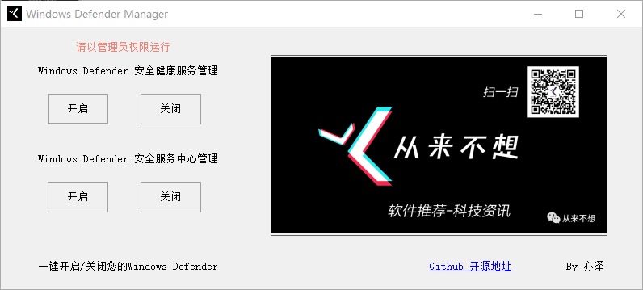

# WindowsDefenderManager

一键关闭/开启Windows Defender

相信大家在使用电脑软件的时候，有时会遇到Windows Defender悄无声息的删掉电脑中软件的情况，而且Windows Defender没法手动关闭，本工具的作用就是管理Windows Defender的开启和关闭

软件截图

成品软件下载地址

[https://www.lanzoui.com/b05mjkqgj](https://www.lanzoui.com/b05mjkqgj)
